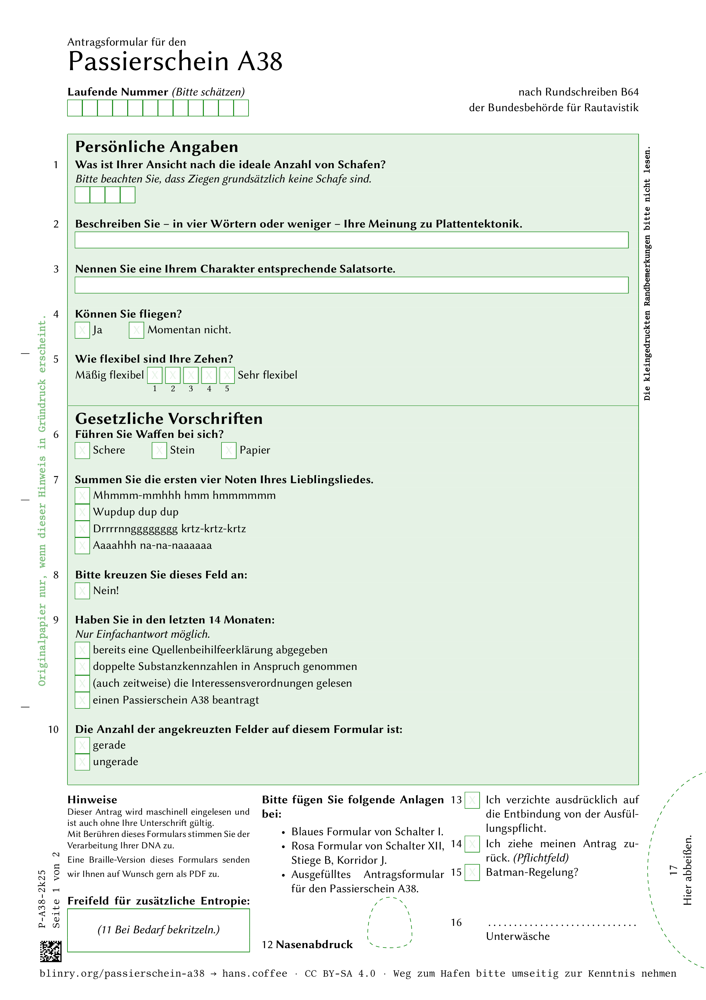
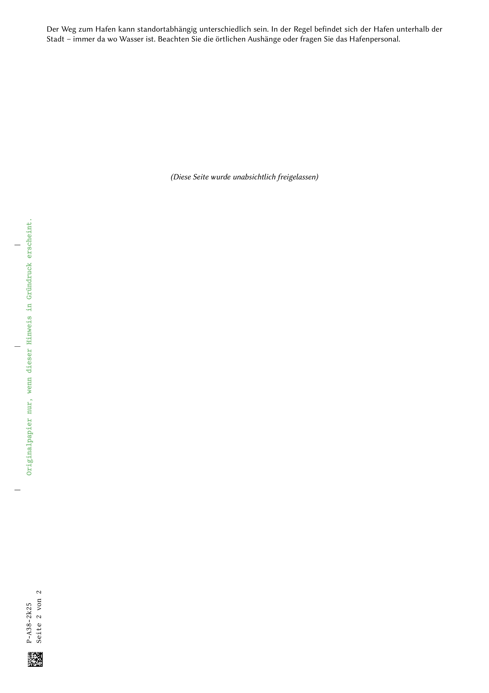

# Passierschein A38

[](https://www.latex-project.org/get/)
[](https://de.wikipedia.org/wiki/Schland)
[](https://creativecommons.org/licenses/by-sa/4.0/)


Dies ist mein Versuch, den großartigen [Passierschein A38 von blinry](https://blinry.org/passierschein-a38/) in LaTeX im Stil von deutschen Amtsdokumenten nachzubauen.
Die Inhalte der Vorderseite sind mit minimalen Anpassungen wörtlich übernommen.

 


## PDF erzeugen

Mittels LuaLaTeX.
Folgende Hilfsfunktion wird bereitgestellt:

```sh
make passierschein-a38.pdf
# oder
latexmk -cd -f -lualatex -interaction=nonstopmode -synctex=1 --output-directory=__LaTeX-build.nosync -latexoption=--shell-escape passierschein-a38.tex
```


## Lizenz

Wie das Original ist diese Version unter CC BY-SA 4.0 lizensiert.

Für weitere Informationen siehe [LICENSE.md](LICENSE.md).
